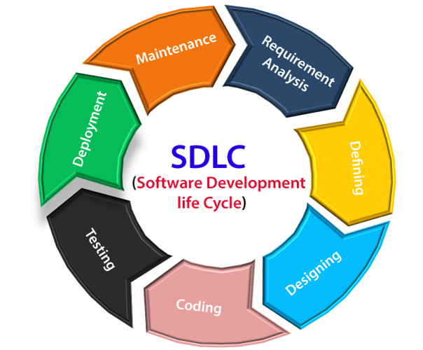
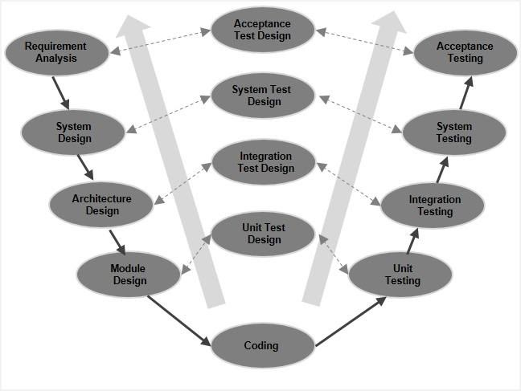
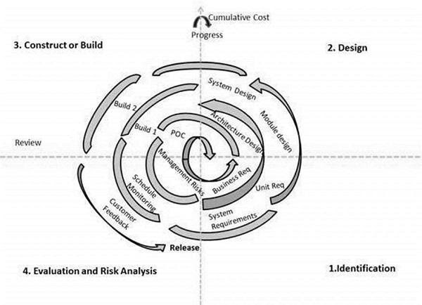
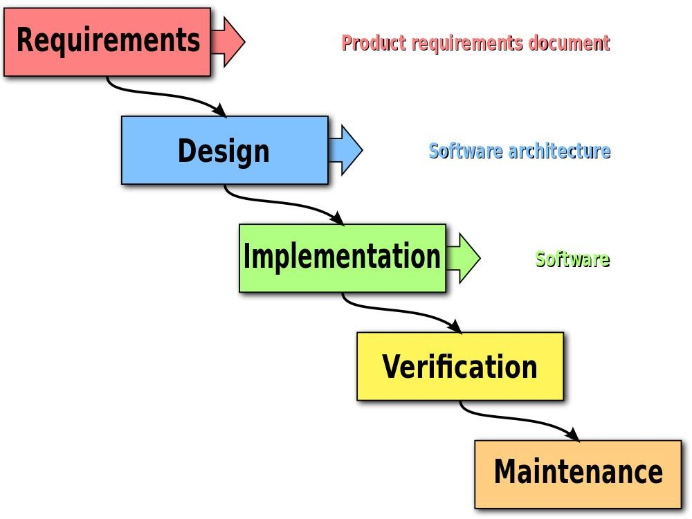
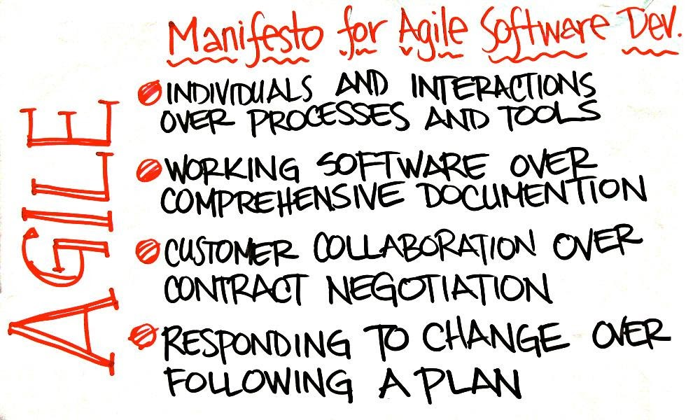

SDLC stands for Software Development Life Cycle. It is a process used by software developers to design, develop, test, and deploy software applications. The purpose of SDLC is to produce high-quality software that meets or exceeds customer expectations, is delivered on time and within budget, and is easy to maintain and update. SDLC involves a series of well-defined phases, each with its own set of activities and deliverables. The exact phases and activities can vary depending on the specific SDLC model being used, but the common phases include:

1. **Planning:** In this phase, project goals, scope, budget, and timelines are defined. Key stakeholders are identified, and a project plan is created.

2. **Feasibility Study:** This phase involves assessing the technical and financial feasibility of the project. It helps in determining whether the project is viable and worth pursuing.

3. **Requirements Analysis:** This phase involves gathering and documenting detailed requirements from stakeholders. This includes functional and non-functional requirements that the software must meet.

4. **Design:** In this phase, the system architecture is designed based on the requirements. This includes defining the overall structure of the system, specifying hardware and software components, and creating a detailed design for each component.

5. **Implementation (Coding):** This phase involves actual coding or programming of the software. Developers write code according to the design specifications.

6. **Testing:** The software is tested to ensure that it meets the specified requirements. Testing can include unit testing, integration testing, system testing, and user acceptance testing.

7. **Deployment:** The software is released to the end-users or customers. This phase may also involve training end-users and providing documentation.

8. **Maintenance and Support:** After deployment, the software enters a maintenance phase. This involves fixing bugs, making updates to meet changing requirements, and providing ongoing support.

## Types of SDLC

**V-Model (Verification and Validation Model):**

An extension of the waterfall model where each development stage has a corresponding testing phase.
Each phase must be completed before moving on to the next, and testing is integrated throughout the development process.
Emphasizes the importance of early testing.

### Phases:
1. **Requirements Specification (Left Side of the "V"):**
   - **Development Phase:** In this phase, the system requirements are analyzed, and a detailed specification is created.
   - **Testing Phase:** The testing phase corresponding to the requirements specification is the "Requirements Testing" phase. Here, test planning and design are initiated based on the specified requirements.

2. **System Design (Left Side of the "V"):**
   - **Development Phase:** The system architecture and design are created based on the requirements.
   - **Testing Phase:** The "Architectural Design Testing" phase involves testing the system design and architecture.

3. **Coding (Left Side of the "V"):**
   - **Development Phase:** The actual coding or implementation of the software is carried out.
   - **Testing Phase:** The "Unit Testing" phase involves testing individual components or modules of the software.

4. **Unit Testing (Bottom of the "V"):**
   - **Development Phase:** Individual components or modules are tested in isolation.
   - **Testing Phase:** The unit testing phase corresponds to the coding phase and involves verifying that each unit of the software performs as intended.

5. **Integration Testing (Middle of the "V"):**
   - **Development Phase:** The individual components or modules are integrated to form the complete system.
   - **Testing Phase:** The "Integration Testing" phase involves testing the interactions between integrated components.

6. **System Testing (Right Side of the "V"):**
   - **Development Phase:** The complete system is tested as a whole to ensure it meets the specified requirements.
   - **Testing Phase:** The "System Testing" phase corresponds to the system design phase and involves validating the entire system.

7. **Acceptance Testing (Right Side of the "V"):**
   - **Development Phase:** The system is delivered to the customer for acceptance.
   - **Testing Phase:** The "Acceptance Testing" phase involves testing the system in a production-like environment to ensure it meets user acceptance criteria.

**Spiral Model:**

Combines the idea of iteration with the systematic aspects of the waterfall model.
The development process is represented as a spiral, with each loop representing a phase (planning, risk analysis, engineering, testing).
Especially useful for large, complex projects with a high level of risk.

**Big Bang Model:**

A less structured approach where there is no specific process or predefined sequence of activities.
Development and testing are performed haphazardly until the software is considered complete.
Suitable for small projects or proof-of-concept development.

**Waterfall Model:**

A linear and sequential approach where each phase must be completed before moving on to the next.
Progress is seen as flowing steadily downwards, like a waterfall.
Well-suited for projects with well-defined and stable requirements.

**Agile Model:**

An iterative and incremental approach that focuses on flexibility and collaboration.
Development is carried out in small, incremental cycles called sprints.
Requirements and solutions evolve through the collaborative effort of self-organizing cross-functional teams.

# Software Prototype

Software prototyping is a development methodology that involves creating a preliminary version of a system with limited functionality in order to gather feedback and understand user requirements. The prototype serves as a tangible representation of the final product and helps in validating design decisions, functionality, and user interfaces before the full development process begins. The primary goals of software prototyping include:

1. **Gathering User Feedback:** Prototypes allow users to interact with a visual representation of the software early in the development process. This enables users to provide feedback on the design and functionality, helping to identify potential issues and improvements.

2. **Clarifying Requirements:** Prototyping helps to clarify and refine user requirements. As users interact with the prototype, they may discover additional features, changes, or improvements that were not initially considered during the requirements gathering phase.

3. **Reducing Risk:** By creating a prototype, development teams can assess the feasibility of implementing certain features and functionalities. This helps in identifying potential technical challenges and risks early in the development process.

4. **Improving Communication:** Prototypes provide a common ground for discussions between developers, designers, and users. They facilitate communication by offering a visual representation of the software, making it easier for stakeholders to understand and discuss ideas.

There are different types of software prototypes, including:

1. **Throwaway or Rapid Prototyping:** In this approach, a quick and disposable prototype is created to explore design ideas and gather feedback. Once feedback is collected, the prototype is discarded, and the actual development process begins based on the lessons learned.

2. **Evolutionary Prototyping:** This approach involves refining and extending the initial prototype based on user feedback and evolving it into the final product. The prototype gradually transforms into the complete system through multiple iterations.

3. **Incremental Prototyping:** This method involves developing the prototype in small, incremental segments. Each increment adds new features or refines existing ones. The increments are integrated to form the complete system over time.

Key Advantages of Software Prototyping:

1. **Early Detection of Issues:** Prototypes help in identifying design flaws, missing requirements, or misunderstandings early in the development process, reducing the cost of later corrections.

2. **User Involvement:** Users can actively participate in the development process by providing feedback on the prototype, ensuring that the final product meets their expectations.

3. **Improved Communication:** Prototypes enhance communication between developers, designers, and stakeholders by providing a tangible representation of the software.

4. **Risk Mitigation:** Prototyping allows for the early identification and mitigation of technical and project-related risks.

